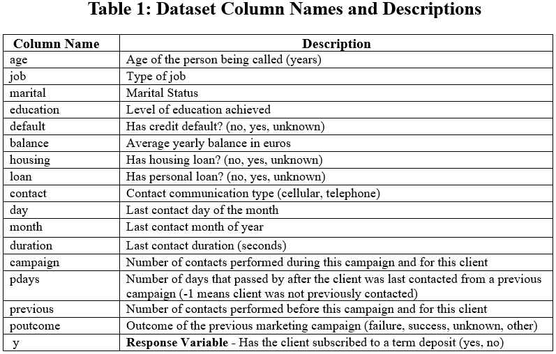
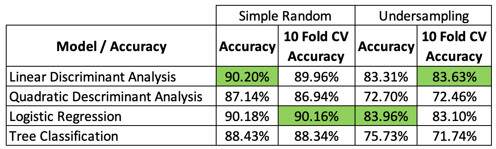
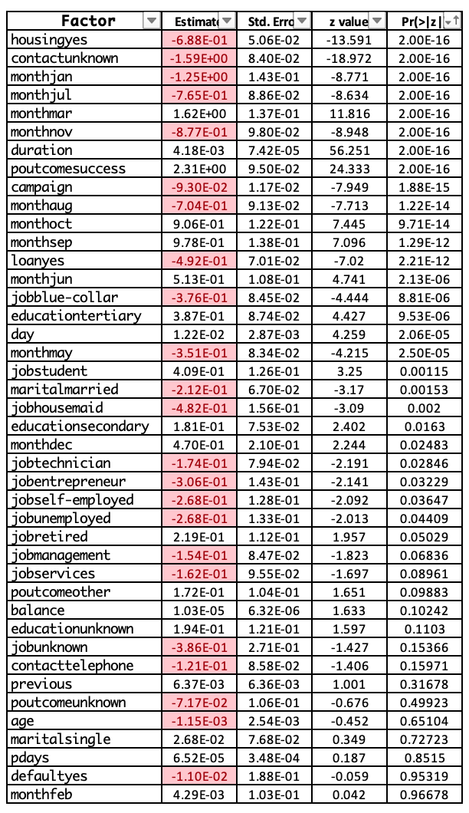

\newpage

\tableofcontents

\newpage

```{r, message = FALSE}
#Loading required packages:
library(readr)
library(dplyr)
library(regclass)
library(MASS)
library(ISLR)
library(klaR)
library(tree)
library(VGAM)
library(ggplot2)
library(ggsci)
library(corrplot)
library(grid)
library(gridExtra)
library(caret)
library(car) 
library(tidyverse)
library(ROSE)
library(Rfast)
library(nnet)
library(vcdExtra)
library(energy)
library(QuantPsyc)
```

# 1. Introduction

Marketing plays a key role in business, banks included. It allows
businesses to raise awareness of the products or services they offer,
differentiate their products from competitors by educating their
customers or potential customers. Most importantly it can allow a
business to grow their customer base and earn higher profits.

Our data set which was obtained through direct marketing (telemarketing)
of a Portuguese banking institution contains a variety of information on
those who participated in the calls. The information gathered ranges
from things such as; age, types of loans the person has (home or auto),
marital status and education level among many others. There is immense
value in being able to predict what demographic is more likely to
subscribe to a certain product or service a business may offer. It would
allow business to target marketing campaigns more efficiently for
certain groups of individuals.

Our group's goal is to build a binary classification model with our data
set to gain a better understanding of what type of demographic is more
likely to open a term deposit than not. We also want to evaluate how
accurate our models are at making these predictions.

# 2. Data set

The data set was obtained from the UCI Machine Learning Repository. It
is a public data set that can be used for research [1][2]. The data set
consists of 45,211 observations with 16 explanatory variables (5 numeric
and 11 categorical variables).

```{r, out.width = '90%', echo = FALSE}

```

```{r}
#Import the data set
banking_marketing_dataset <- read_delim("banking_marketing_dataset.csv",delim=";",escape_double=FALSE,trim_ws=TRUE)
```

```{r}
#Basic descriptive statistics for each:
summary(banking_marketing_dataset)
```

## 2.1 Data Wrangling

This data set at first glance is very easy to work with and doesn't
require much processing to work with. We will check for null data and
scrub it from the data frame prior to doing any analysis.

```{r}
#Remove nulls where appropriate, although our data looks clean and the row count remains the same.
banking_marketing_dataset<-na.omit(banking_marketing_dataset)
```

```{r}
#In order to help some some of our visuals in the Exploratory Data Analysis, we binned our age groups:
age_breaks<-c(17,25, 30, 40, 50, 60, Inf)
age_labels<-c("18-25", "26-30", "31-40", "41-50", "51-60", "61+")
banking_marketing_dataset$age_group<-cut(banking_marketing_dataset$age,breaks=age_breaks,labels=age_labels)

#We also binned the "duration" of calls:
duration_breaks<-c(-1,180,360,600,900,1200,1500,Inf)
duration_labels<-c("0-3 min","3-6 min","6-10 min","10-15 min", "15-20 min", "20-25 min", "25+ min")
banking_marketing_dataset$duration_group<-cut(banking_marketing_dataset$duration,breaks=duration_breaks,labels=duration_labels)
```

# 3. Guiding Question

Based on the data set, the objective of the project is to analyze the
factors affecting a customer's choice to open a bank account. The best
model will be chosen from the candidate models constructed by different
statistical approaches. This model is aimed to detect if the person
approached by the bank will be becoming their permanent customer.
Moreover, the data set contains the person's personal past banking
choices as well as the marketing approach taken by the bank at the time.
This will give us a broader view towards the variables correlating with
our response variable. This study will help the banking institution to
devise a customer tailored marketing experience.

# 4. Exploratory Data Analysis

## 4.1 EDA on Individual Features

In order to better understand the data, some preliminary exploratory
data analysis was completed to get a better understanding of what this
data set contains and potential pitfalls within it.

```{r}
ggplot(banking_marketing_dataset, aes(x = y, fill=y))+geom_bar()+geom_text(stat='count',aes(label= paste(after_stat(count),"(",scales::percent(after_stat(count/sum(count)),accuracy=0.1),")")),vjust=-0.5)+labs(x="Signed on for Term Deposit",y="Frequency",title="Telemarketing Calls: Term Deposits Signed On") 
```

First we look into just how often a call is actually successful. Within
our data set, 11.7% of calls result in a client signing up for a term
deposit. Given that, we would expect our models to be highly accurate
considering this project's response variable is binary.

```{r}
#Grouping and Aggregating Data (Calculating mean balance by job):
mean_balance_by_job<- banking_marketing_dataset%>%group_by(job)%>%summarize(mean_balance = mean(balance))
arrange(mean_balance_by_job,desc(mean_balance))
```

The mean of balances across jobs is rather surprising, containing a
spread of about 1,000 euros from the highest mean balance to lowest mean
balance. As such, initially we do not expect it to play a big factor in
determining whether or not a person signs up for a term deposit.

```{r}
#Compare factors related to an individuals personal life situation

#Create individual ggplot objects
plot1<-ggplot(banking_marketing_dataset,aes(x=marital,fill=y))+geom_bar(position= "fill")+labs(y="Stacked Proportion")

plot2<-ggplot(banking_marketing_dataset,aes(x=education,fill=y))+geom_bar(position="fill")+labs(y="Stacked Proportion")

#Arrange the plots using grid.arrange and add a title
grid.arrange(plot1,plot2,nrow=1,top=textGrob("Individual Life Factors Effect on Proportion of Telemarket Success"))


```

Personal life situation:

At a high level, for the main categorical variables the order of
proportions (from highest to lowest) that people sign up for term
deposits are:

a)  Marital status - single \> divorced \> married

b)  Education - tertiary \> unknown \> secondary \> primary

These seem reasonable given that single people and more educated people
likely have more disposable income to sign up for term deposits with.

```{r}
# Compare factors related to an individuals financial situation

# Create individual ggplot objects
plot1<-ggplot(banking_marketing_dataset,aes(x=default,fill=y))+geom_bar(position="fill")+labs(y="Stacked Proportion")

plot2<-ggplot(banking_marketing_dataset,aes(x=housing,fill=y))+geom_bar(position="fill")+labs(y="Stacked Proportion")

plot3<-ggplot(banking_marketing_dataset,aes(x=loan,fill=y))+geom_bar(position="fill")+labs(y="Stacked Proportion")

#Arrange the plots using grid.arrange and add a title
grid.arrange(plot1,plot2,plot3,nrow=1,top=textGrob("Individual Financial Factors Effect on Proportion of Telemarket Success"))
```

Financial standing categories:

a)  Has previously defaulted? Unsurprisingly, if someone defaulted
    before, they're less likely to sign up for a term deposit.

b)  Has a housing loan? If someone has a housing loan, they're less
    likely to sign up for a term deposit. Intuitively this makes sense,
    as those who have a mortgage typically will prioritize paying the
    mortgage off before investing the money in a savings account.

c)  Has a personal loan? if someone has a personal loan, they're again
    less likely to sign up for a term deposit. For very a very similar
    reason we would expect someone with a mortgage to not sign up for a
    savings account we would expect the same for someone with a loan.

The Job Category has a lot of classes in it, so that will be looked at
separately for better visibility.

```{r}
#Compare job types and to see what is the most represented

banking_marketing_dataset %>%count(job, y) %>%mutate(job = reorder(job, n)) %>%ggplot(aes(x=job,y=n,fill=y)) +geom_bar(stat="identity")+coord_flip()+labs(x="Job Categories",y="Frequency",title="Telemarketing Success as a Function of Job Categories",fill="y")
```

Roughly 70% of our data set consists of people with that work
blue-collar, management, and technician jobs. Generally speaking, it
might be reasonable to assume that banks are targeting individuals with
stables jobs that have a moderate to good income. Something else worth
mentioning is that it would a appear that those in management positions
seem much more likely to open a savings account more so than those
working a blue collar job.

```{r}
# Investigate whether or not the duration of the call appears to have any impact on the term deposit sign up rate

percent_by_duration <- banking_marketing_dataset %>%group_by(duration_group)%>%summarize(total_count = n(),yes_count = sum(ifelse(y == "yes", 1, 0))) %>%mutate(percentage_yes = round((yes_count / total_count) * 100, 1))
percent_by_duration
```

The result above shows that the longer a telemarketer kept someone on
the phone, the more successful they were in getting that person to sign
up for a savings account.

If we had to look at the distribution around when calls are made by
month and the success rate of those calls, we can see below that a large
percentage of calls are made in the month of May. However, even though
less calls were made in the months of December and March, they appear to
have a higher success rate during these months.

```{r}
percent_by_month <- banking_marketing_dataset %>%group_by(month)%>%summarize(total_count = n(),yes_count = sum(ifelse(y == "yes", 1, 0))) %>%mutate(percentage_yes = round((yes_count / total_count) * 100, 1))
percent_by_month
```

The next two plots will investigate the impact of age on the response
variable y:

```{r}
# Create density plots 
ggplot(banking_marketing_dataset,aes(x=age,fill=y))+geom_density(alpha=0.5)+labs(x="Age",y="Density",title = "Density of y Against age")+scale_x_continuous(breaks=seq(0,100,by=10))
```

This plot highlights that the extremities where people are \<25 years
old and \>60 years old tend to sign up for term deposits more often than
those in between. This is also corroborated in the probability table
below.

```{r}
#Create fixed segments for age
age_segments<-cut(banking_marketing_dataset$age,breaks=c(18,26,31,41,51,61,max(banking_marketing_dataset$age)+1),labels=c("18-25","26-30","31-40","41-50","51-60","61+"),include.lowest = TRUE)

#Create a contingency table with the variables "age segments" and "y"
contingency_table<-table(age_segments,banking_marketing_dataset$y)

#Calculate the row proportions as percentages
row_proportions<-prop.table(contingency_table,margin=1)*100

#Calculate the counts of "yes" and "no" instances
count_table<-addmargins(contingency_table,margin=2)

#Combine row proportions and count table
combined_table<-cbind(row_proportions,count_table)
combined_table

```

```{r}
# Create a histogram of custom age group categories:

ggplot(banking_marketing_dataset,aes(x=age_group,fill=y))+geom_bar(color="black")+geom_text(stat='count',aes(label = after_stat(count)),position = position_stack(vjust = 0.6),color="black")+labs(x="Ages", y="Frequency",title="Age Groups and S# Successes and Failures")
```

The most targeted age groups are roughly middle aged people (31-40,
41-50). From a logical perspective, it makes sense to target given that
these individuals are in the middle of their careers and more
established. These individuals likely have disposable income. However,
as shown by the density plot above and contingency/probability table the
most successful calls are actually to the youngest and oldest
individuals.

Perhaps the missing feature in this data set is how much or how long of
a term deposit an individual signed up for. It's possible that young/old
people sign up for low amounts or times, while middle-aged people get
higher value term deposits that make the bank more profit.

```{r}
# Investigate poutcome feature to see how prevalent it is:

ggplot(banking_marketing_dataset,aes(x=poutcome,fill=y))+geom_bar(color="black",position="dodge")+labs(x="poutcome(previous outcome)",y="Frequency",title="Count of Outcome for each category of poutcome (previous outcome)")
```

In this plot we intentionally wanted to highlight the disparity in the
number of unknowns to the "failure, success, other" poutcomes feature
classes. The vast majority of these calls have an unknown previous
outcome, hinting that it might potentially be a poor variable to model
with.

## 4.2 EDA on Potential Relationships With Variables

The boxplot below hints that there could be some messy data within the
retired category, where we see outliers of 25 year olds that are
retired. It seems that within a job category, the age of the person has
no material impact in their willingness to sign up for a term deposit.
Interestingly though, older retired people (ages \~ 55-75) seem to sign
up for term deposits more often than younger retired people (ages \~
50-55).

```{r}
#Compare job categories, age, and y response variable to see if there's a story here:
ggplot(banking_marketing_dataset,aes(x=age,y=job,fill=y))+geom_boxplot()+labs(x="Age",y ="Job",title="Outcome Based on Job Categories and Age")+theme_minimal()
```

## 4.3 Relationships between the Quantitative Variables

It is important to understand if any sort of relationships (ie.
multicollinearity) exists between dependent variables as it can cause
issues when building out our models. In order to investigate whether any
sort of relationships exists between the "quantitative" variables we can
use a correlation matrix. During our model building we will also
calculate the VIF (Variance Inflation Factor) for the variables present
in our model.

```{r}
# Selecting numeric columns from the data set:
numeric_cols <- sapply(banking_marketing_dataset, is.numeric)
numeric_data <- banking_marketing_dataset[, numeric_cols]

#Computing the correlation matrix:
cor_matrix <- cor(numeric_data)

#Creating a custom color scheme:
my_colors <- colorRampPalette(c("white", "#00868B"))(100) 

#Creating the correlation heatmap with the custom color scheme:
corrplot(cor_matrix, method = "color", type = "upper", tl.cex = 0.8,
         tl.col = "black", col = my_colors,
         addCoef.col = "black", number.cex = 0.7, tl.srt = 50,title = "Correlation Heatmap")

cat("\n")
```

The correlation plot shows that the there are no significant
relationships detected between the quantitative variables in our data
set. The closest one would be pdays and previous, which makes sense
since pdays is the number of days since last contact and previous is the
number of contacts performed before this campaign and for this client.
The driver behind this relationship is likely that customers being
contacted the first time have no previous data.

## 4.4 Relationships between the various Quantitative and Qualitative Variables

In order to compare relationships between the "quantitative" and
"quantitative" variables we can use a few tools, we can use box plots,
bar plots, perform T-test (ANOVA), scatter plots etc. Below we will use
the ANOVA function and print the results of only the relationships
between quantitative and qualitative variables that are significant (ie.
p-value \< 0.05).

It is evident from below that numerous "significant" relationships
exists between many of the quantitative and quantitative variables in
our data set. Again, we will need to be cognizant of this during our
model building as this will pose a challenge when attempting to only
select the best variables which may have an impact on the dependent
variable.

```{r}
#Specify the qualitative variables and quantitative variables from the data set and store them in a vector
qual_variables<-c("job","marital","education","default","housing","loan","contact","day","month","poutcome")
quant_variables<-c("age","balance","duration","campaign","previous")

#Iterate over the qualitative variables
for (qual_var in qual_variables) {
  
  #Fit ANOVA model for the current qualitative variable against each quantitative variable
  for (quant_var in quant_variables) {
    model<-aov(as.formula(paste(quant_var,"~",qual_var)),data=banking_marketing_dataset)
    anova_table<-summary.aov(model)
    
    #Get the p-value from the ANOVA table
    p_value<-anova_table[[1]]$Pr[1]
    
    #Check if the p-value is significant (ie. p-value < 0.05) and if so print the results
    if (p_value<0.05) {
      cat("\nANOVA Results for", qual_var, "vs", quant_var, "\n")
      print(anova_table)
    }
  }
}
```

## 4.5 Relationships between the various Qualitative Variables

In order to compare relationships between the various "qualitative"
variables we will conduct a Chi-square test and print the results of
only the relationships between qualitative variables that are
significant (ie. p-value \< 0.05).

Again similar to our analysis above numerous "significant" relationships
exists between many of the qualitative variables in our data set. Again,
caution will be used when building out our models.

```{r}
# Specify the qualitative variables
qual_variables <- c("job", "marital", "education", "default", "housing", "loan", "contact", "day", "month", "poutcome")
qual_variables[2]

# Perform chi-square test for all combinations of variables
for (i in 1:length(qual_variables)) {
  for (j in (i+1):length(qual_variables)) {
    # Create a contingency table
    contingency_table<-table(banking_marketing_dataset[,c(qual_variables[i],qual_variables[j])])
    
    # Perform chi-square test
    chi_square_test<-chisq.test(contingency_table)
    
    # Check if the p-value is significant (e.g., p-value less than 0.05)
    if (chi_square_test$p.value<0.05) {
      # Print the significant chi-square test results
      cat("Chi-Square Test for",qual_variables[i],"vs",qual_variables[j], "\n")
      print(chi_square_test)
      cat("\n")
    }
  }
}
```

# 5. Sampling Methodology

An assumption we have made with out data set is that it is a good
"representation" of the population from which it was taken. Meaning that
all relevant subgroups or "strata" that are characteristically different
from one another in the population have been captured in our sample data
set. We have also made the assumption that the subgroups or strata in
the data set are represented "proportionally" to the population from
which they were taken.

That being said we plan to train and evaluate our models with two
different sampling strategies each with a 75-25 train-test sample size.
The two difference sampling strategies we will employ on our data set
are found below.

1)  Simple Random Sampling
2)  Undersampling

We will use the simple random sampling data sets as our "baseline" in
order to evaluate and compare our models performance and accuracy. We
will then use the undersampling in order to draw a equal proportion of
our dependent variable (y) in our train and test sample sets to
evalulate the impact on our models accuracy and performance.

## 5.1 Create Train and Test Simple Random Sample Data Subsets with 75-25 Split

Below we will create "Train" and "Test" data subsets from our original
data set using simple random sampling. The split will be; 75% of the
original subset observations will be assigned to the "Train" subset and
the remaining 25% will be assigned to the "Test" subset.

```{r}
#original split
  set.seed(1)
  idx=sample(dim(banking_marketing_dataset)[1],round(nrow(banking_marketing_dataset)*0.75,0))
  Train1=banking_marketing_dataset[idx,]
  Test1=banking_marketing_dataset[-idx,]
```

```{r}
#Train data sub set
table_1 = as.table(table(Train1$y))
prop.table(table_1)

#Test data sub set
table_2 = as.table(table(Test1$y))
prop.table(table_2)

#Entire data set
prop.table(table(banking_marketing_dataset$y))
```

We can see above that the proportion of "yes" and "no" data points in
our "Train" and "Test" data sub sets roughly follows the same proportion
in our entire sample. For this reason we have decided not to include a
"stratified" sampling approach that would allocate the same proportions
to the Test and Train data set as it would produce a similar result.

## 5.2 Create Train and Test Undersampled Data Subsets with 75-25 Split

Below we will create "Train" and "Test" data subsets from our original
data set using "under sampling." The split will be; 75% of the original
subset observations will be assigned to the "Train" subset and the
remaining 25% will be assigned to the "Test" subset. The resultant or
"dependent" variable "y" will have proportional allocation of 50% - yes
and 50% - no in both the Train and Test data subsets. Whether utilizing
these Test or Train data subsets will have a positive or negative impact
on our models accuracy is to be investigated.

```{r}
#Create the "undersampled" data set and display the top few lines
undersampling_df<- ovun.sample(y ~ ., data = banking_marketing_dataset, method = "under", p = 0.5, seed = 1)$data
head(undersampling_df)
```

```{r}
#Check the dimensions of the under sampled data set
dim(undersampling_df)
```

```{r}
#Create under sampled Test and Train Data Subsets
  set.seed(1)
  idx=sample(dim(undersampling_df)[1],round(nrow(undersampling_df)*0.75,0))
  Train2=undersampling_df[idx,]
  Test2=undersampling_df[-idx,]
```

```{r}
#Confirm 50-50 proportional based on "y" for Test and Train data subsets and Undersampled data set
table_2 = as.table(table(Train2$y))
prop.table(table_2)
table_2

table_3 = as.table(table(Test2$y))
prop.table(table_3)
table_3

prop.table(table(undersampling_df$y))
```

As we can see above we have created a 50-50 proportional under sampled
data set along with the respected 75-25 Test-Train data subsets in which
we will be using to train and test our various models.

## 6 Model Fitting

In this section we will look to train, test and evaluate the following
types of models for our two sampling methods discussed earlier.

-Linear Discriminant Analysis -Quadratic Discriminant Analysis -Logistic
Regression -Classification Tree.

## 6.1 Linear Discriminant Analysis (LDA) (Simple Random Sampling)

In order to fit our data to a LDA model we need to ensure the following
assumptions are met.

Independence: Our observations are phone calls to various individuals
and we have no reason to suspect they are NOT independent. Normality:
Does not appear to hold for certain variables as can be seen in the
QQ-plots below.\
Linear Separability: The data can be seperated by a linear bounder, TBD.
We will investigate QDA as well.

```{r}
#Create a subset the data set to include only numeric/quantitative variables
numeric_data<-banking_marketing_dataset[, numeric_cols]

#Create QQ plots for each numeric/quantitative variables
for (col in colnames(numeric_data)) {
  qqnorm(numeric_data[[col]])
  qqline(numeric_data[[col]])
}
```

```{r}
#Train a LDA model using the SRS sample Train data subset
lda.fit1<-lda(y~., data=Train1)
lda.fit1
```

```{r}
plot(lda.fit1)
```

```{r}
#Using the trained LDA model predict using the SRS Test Data Subset
set.seed(1)
lda.pred1=predict(lda.fit1, Test1)
table(lda.pred1$class, Test1$y)
```

```{r}
paste('Accuracy rate for full LDA model: ', 100-round(100*mean(lda.pred1$class!=Test1$y),2),'%',sep='')
```

In an attempt to improve the LDA models accuracy we will reduce our
initial LDA model by reducing the model based on positive discriminant
values.

```{r}
#Train a reduced LDA model base on the SRS sample Train data subset
lda.fit.2<-lda(y~age+marital+education+balance+day+month+duration+previous+poutcome, data=Train1)
lda.fit.2
```

```{r}
plot(lda.fit.2)
```

```{r}
#Using the trained "reduced" LDA model predict using the SRS Test Data Subset
set.seed(1)
lda.pred.2=predict(lda.fit.2, Test1)
table(lda.pred.2$class, Test1$y)

```

```{r}
paste('Acccuracy rate for reduced LDA model: ', 100-round(100*mean(lda.pred.2$class!=Test1$y),2),'%',sep='')
```

We can see from above that we have now managed to increase our LDA
models accuracy ever so slightly from 89.9% to 90.0%, by removing
certain variables. We will use 10 fold Cross Validation now on our
"reduced" model in order to evluate its performance. We have elected to
go with the reduced LDA because of its slightly higher accuracy but also
because it is a simpler (less variables) model to interpret.

## 6.1.1 Evaluating the LDA Models Performance using 10 Fold Cross Validation (Simple Random Sampling)

We can see from below that the accuracy of the reduced LDA model is
89.96%. This aligns very closely with the accuracy we found above
(90.06%). his gives us good confidence in our models performance.

```{r}
#Creating folds
set.seed(1)
folds1 = createFolds(factor(banking_marketing_dataset$y), k=10)
```

```{r}
#Create a formula for calculating the classifications rate
misclassification_lda<-function(idx){
  Train<-banking_marketing_dataset[-idx,]
  Test<-banking_marketing_dataset[idx,]
  fit<-lda(y~age+marital+education+balance+day+month+duration+previous+poutcome, data=Train)
  pred<-predict(fit,Test)
  return(mean(pred$class==Test$y))
}
```

```{r}
mis_rate1 = lapply(folds1, misclassification_lda)
```

```{r}
paste('Accuracy rate for full LDA model: ', round(100*mean(as.numeric(mis_rate1)),2),'%',sep='')
```

## 6.2 Linear Discriminant Analysis (LDA) (Undersampling)

```{r}
#Train a LDA model base on the undersampled Train data subset
lda.fit1<-lda(y~., data=Train2)
lda.fit1
```

```{r}
plot(lda.fit1)
```

```{r}
#Using the trained LDA model predict using the undersampled Test data subset
set.seed(1)
lda.pred1=predict(lda.fit1, Test2)
table(lda.pred1$class, Test2$y)
```

```{r}
paste('Accuracy for full LDA model: ', 100-round(100*mean(lda.pred1$class!=Test2$y),2),'%',sep='')
```

We can see from above that we have now decreased our LDA models accuracy
from 89% to 83% when we utilized the under sampled data sets. We have
gained a larger number of "yes" predictions, however, for the purpose of
this project. We want to be able to accurately model what factors or
variables may influence a person decision to open a term account.

Producing a model that gives false "hope" to bankers would be cruel...

Again just as we carried out earlier, we will look to improve on our LDA
models accuracy by reducing the model based on positive discriminant
values.

```{r}
#Train a reduced LDA model base on the under sampled Train data subset
lda.fit.2<-lda(y~age+marital+education+default+balance+day+month+duration+previous+poutcome, data=Train2)
lda.fit.2
```

```{r}
plot(lda.fit.2)
```

```{r}
set.seed(1)
lda.pred2=predict(lda.fit.2, Test2)
table(lda.pred2$class, Test2$y)
```

```{r}
paste('Accuracy rate for reduced LDA model: ', 100-round(100*mean(lda.pred2$class!=Test2$y),2),'%',sep='')
```

We can see from above that we have managed to decrease our LDA models
accuracy from 83.31% to 79.98%, by removing certain variables. We will
use 10 fold Cross Validation now on our "full" model in order to
evaluate its performance based on the higher accuracy.

## 6.2.1 Evaluating the LDA Models Performance using 10 Fold Cross Validation (Undersampling)

We can see from below that the accuracy of the full LDA model is 83.67%
using 10 Fold Cross Validation. This aligns very closely with the
accuracy we found above (83.28%). This gives us good confidence in our
models performance.

```{r}
#Creating folds
set.seed(1)
folds2 = createFolds(factor(undersampling_df$y), k=10)
```

```{r}
#Create a formula for calculating the classifications rate
misclassification_lda_2<-function(idx){
  Train<-undersampling_df[-idx,]
  Test<-undersampling_df[idx,]
  fit<-lda(y~., data=Train)
  pred<-predict(fit,Test2)
  return(mean(pred$class==Test2$y))
}
```

```{r}
mis_rate2 = lapply(folds2, misclassification_lda_2)
```

```{r}
paste('Accuracy rate for full LDA model: ', round(100*mean(as.numeric(mis_rate2)),2),'%',sep='')
```

# 6.3 Quadratic Discriminant Analysis (QDA) (Simple Random Sampling)

Much like LDA the assumptions for QDA also include "independence" and
"normality". However, there is no assumption for "linear separability".

```{r}
#Train a QDA model base on the Simplified Random Sampling Train data subset
qda.fit.1<-qda(y~., data=Train1)
qda.fit.1
```

```{r}
#Using the trained QDA model predict using the Simplified Random Sampling Test data subset
set.seed(1)
qda.pred.1=predict(qda.fit.1, Test1)
table(qda.pred.1$class, Test1$y)
```

```{r}
paste('Misclassification rate for full QDA model: ', 100-round(100*mean(qda.pred.1$class!=Test1$y),2),'%',sep='')
```

We can see from above that the accuracy of our full QDA model is 87.1%.
Which is close but not as accurate as our LDA model's accuracy of 89.9%.

## 6.3.1 Evaluating the QDA Models Performance using 10 Fold Cross Validation (Simple Random Sampling)

We will again use 10 Fold Cross Validation in order to evaluate our QDA
models performance.

```{r}
#Create folds
set.seed(1)
folds.qda = createFolds(factor(banking_marketing_dataset$y), k=10)
```

```{r}
#Create formula for calculating the misclassification rate
misclassification_qda_1<-function(idx){
  Train<-banking_marketing_dataset[-idx,]
  Test<-banking_marketing_dataset[idx,]
  fit<-qda(y~., data=Train)
  pred<-predict(fit,Test)
  return(mean(pred$class==Test$y))
}
```

```{r}
mis_rate_qda = lapply(folds.qda, misclassification_qda_1)
```

```{r}
paste('Accuracy rate for k-fold QDA model: ', round(100*mean(as.numeric(mis_rate_qda)),2),'%',sep='')
```

We can see from below that the accuracy of the QDA model is 87.47% using
10 Fold Cross Validation. This aligns very closely with the accuracy we
found above (87.7%). This gives us good confidence in our models
performance.

# 6.4 Quadratic Discriminant Analysis (QDA) (Undersampling)

```{r}
#Fit a QDA model to the under sampled Train data set.
qda.fit.2<-qda(y~., data=Train2)
qda.fit.2
```

```{r}
#Using the trained QDA model predict using the undersampled Test data subset
set.seed(1)
qda.pred.2=predict(qda.fit.2, Test2)
table(qda.pred.2$class, Test2$y)
```

```{r}
paste('Accuracy rate for full QDA model: ', 100-round(100*mean(qda.pred.2$class!=Test2$y),2),'%',sep='')
```

We can see from above that the accuracy of our full QDA model is 72.7%
using the undersampled data sets.

## 6.4.1 Evaluating the QDA Models Performance using 10 Fold Cross Validation (Undersampling)

We will again use 10 Fold Cross Validation in order to evaluate our QDA
models performance.

```{r}
#Create folds
set.seed(1)
folds.qda.2 = createFolds(factor(undersampling_df$y), k=10)
```

```{r}
#Create a formula for calculating the misclassificaiton rate
misclassification_qda_2<-function(idx){
  Train<-undersampling_df[-idx,]
  Test<-undersampling_df[idx,]
  fit<-qda(y~., data=Train)
  pred<-predict(fit,Test)
  return(mean(pred$class==Test$y))
}
```

```{r}
mis_rate_qda_2 = lapply(folds.qda.2, misclassification_qda_2)
```

```{r}
paste('Accuracy rate for k-fold QDA model: ', round(100*mean(as.numeric(mis_rate_qda_2)),2),'%',sep='')
```

We can see from above that the accuracy of the QDA model is 72.46% using
10 Fold Cross Validation. This aligns very closely with the accuracy we
found above (72.70%).

However, when we used the simple random sample set we found the accuracy
of the QDA model to be 86.94% using 10 Fold Cross Validation. We can see
that again, using under sampling data sets has again resulted in a
inferior models vs simple random sampling. The same phenomenon was
observed with respect to our accuracy in the LDA models.

# 6.6 Logistic Regression Model (Simple Random Sampling)

In order to fit our data to a logistic regression model we need to
ensure the following assumptions are met: "binary" out-come,
"independence", no "multicollinearity" exists. As discussed earlier we
have our dependent or response variable "y" of which there are only two
possible outcomes "yes" and "no" which represent a person's willingness
to sign up for a term account. We have already discussed how we have no
reason to suspect our data points are NOT independent and we will
investigate whether any multicollinearity exists in our model.

```{r}
#Train a Logistic Regression model base on the simple random sample Train data subset
logistic.fit.1<-glm(factor(y)~., family = binomial, data = Train1)
summary(logistic.fit.1)
```

We can see below that the GVIF values of our logistic regression model
are all less than 1.5. This is indicative of low multicollinearity.

```{r}
#Checking the multicollinearity of our LR model
vif(logistic.fit.1)
```

```{r}
#Using the trained LR model predict using the simple random sample Test data subset
set.seed(1)
Prob.predict.1<-predict(logistic.fit.1, Test1, type="response")
Predict<-rep("no",dim(Test1)[1])
Predict[Prob.predict.1>=0.5]="yes"
Actual<-Test1$y
table(Predict, Actual)
```

```{r}
paste('Accuracy rate for full logistic regression model: ', 100-round(100*mean(Predict!=Actual),2),'%',sep='' )
```

The accuracy of our full Logistic regression model is 90.15%.

We will now attempt to improve on the accuracy of our model by removing
any insignificant variables below in order to come up with a "reduced"
logistic regression model.

```{r}
#Train a reduced LR model on the simple random sampling Train data set
logistic.fit.reduced.1<-glm(factor(y)~job+marital+education+housing+loan+contact+day+month+duration+campaign+poutcome, family = binomial, data = Train1)
summary(logistic.fit.reduced.1)
```

We can see below that the GVIF values of our "reduced" logistic
regression model are all less than 1.2. This is indicative of low
multicollinearity.

```{r}
#Checking the multicollinearity of our LR model
vif(logistic.fit.reduced.1)
```

```{r}
#Using the trained reduced LR model predict using the simple random sample Test data subset
set.seed(1)
Prob.predict.reduced.1<-predict(logistic.fit.reduced.1, Test1, type="response")
Predict<-rep("no",dim(Test1)[1])
Predict[Prob.predict.reduced.1>=0.5]="yes"
Actual<-Test1$y
table(Predict, Actual)
```

```{r}
paste('Accuracy rate for our reduced logistic regression model: ', 100-round(100*mean(Predict!=Actual),2),'%',sep='' )
```

We have managed to only slightly improve on the accuracy of our full
logistic regression model by removing some insignificant variables. We
will now use 10 Fold Cross Validation in order to re-enforce the +/- 90%
accuracy of our logistic regression model.

## 6.6.1 Evaluating the Logistic Regression Model Performance using 10 Fold Cross Validation (Simple Random Sampling)

We can see from below that the accuracy of the logistic regression model
is 90.16% using 10 Fold Cross Validation. This aligns very closely with
the accuracy we found above (90.18%). This gives us good confidence in
our logistic regression model. The logistic regression model has so far
given the highest accuracy (90.16%) vs linear discriminant analysis
(89.96%) and quadratic discriminant analysis (87.47%) all with using
simple random sampling.

```{r}
#Create folds
set.seed(1)
folds.log.1 = createFolds(factor(banking_marketing_dataset$y), k=10)
```

```{r}
#Create a function that calculates the misclassification rate of the logistic regression model
misclassification_log_1<-function(idx){
  Train<-banking_marketing_dataset[-idx,]
  Test<-banking_marketing_dataset[idx,]
  logistic.fit<-glm(factor(y)~job+marital+education+housing+loan+contact+day+month+duration+campaign+poutcome, family = binomial, data = Train)  
  accuracy = calc_misclass_log_1(logistic.fit, Test)
  return(accuracy)
}
```

```{r}
#Create a function that will calculate the misclassificaiton rate of a logistic regression model.
calc_misclass_log_1<-function(model,Test){
  Prob.predict<-predict(model, Test, type="response")
  Predict<-rep("no",dim(Test)[1])
  Predict[Prob.predict>=0.5]="yes"
  Actual<-Test$y
  #table(Predict, Actual)
  accuracy = 100-round(100*mean(Predict!=Actual),2)
  paste('Accuracy rate for logistic model fold: ', accuracy,'%',sep='' )
  return(accuracy)
}
```

```{r}
mis_rate_log_1 = lapply(folds.log.1, misclassification_log_1)
```

```{r}
paste('Accuracy rate for k-fold logistic regression model: ', round(mean(as.numeric(mis_rate_log_1)),2),'%',sep='')
```

We will now evaluate how using the under sampled data sets will affect
the accuracy our our logistic regression model.

# 6.6 Logistic Regression Model (Undersampling)

```{r}
#Train a logistic regression model on the undersample data sets
logistic.fit.2<-glm(factor(y)~., family = binomial, data = Train2)
summary(logistic.fit.2)
```

```{r}
#Train a logistic regression model on the undersample data sets
set.seed(1)
Prob.predict.2<-predict(logistic.fit.2, Test2, type="response")
Predict<-rep("no",dim(Test2)[1])
Predict[Prob.predict.2>=0.5]="yes"
Actual<-Test2$y
table(Predict, Actual)
```

```{r}
paste('Accuracy rate for full logistic model: ', 100-round(100*mean(Predict!=Actual),2),'%',sep='' )
```

The accuracy of the full logistic regression model using the under
sampled data set is 83.96%, this pales in comparison to the 90.16% when
we used the simple random sampled data sets. We will again attempt to
improve on this accuracy by removing any insignificant variables from
our full model.

```{r}
#Train a reduced linear regression model on the under sampled Train data subset
logistic.fit.reduced.2<-glm(factor(y)~job+education+balance+housing+loan+contact+month+duration+campaign+poutcome, family = binomial, data = Train2)
summary(logistic.fit.reduced.2)
```

```{r}
#Using the trained reduced LR model predict using the undersampled Test data subset
set.seed(1)
Prob.predict.reduced.2<-predict(logistic.fit.reduced.2, Test2, type="response")
Predict<-rep("no",dim(Test2)[1])
Predict[Prob.predict.reduced.2>=0.5]="yes"
Actual<-Test2$y
table(Predict, Actual)
```

```{r}
paste('Accuracy rate for reduced logistic model: ', 100-round(100*mean(Predict!=Actual),2),'%',sep='' )
```

As you can see from above, we have not managed to increase the accuracy
of our full logistic regression model, as it is stagnant at 83.96%. We
will attempt to validate this accuracy by using 10 Fold Cross Validation
next.

## 6.6.1 Evaluating the Logistic Regression Model Performance using 10 Fold Cross Validation (Undersampling)

We can see below that the accuracy of the logistic regression model
using 10 Fold Cross Validation does align again with out initial
accuracy calculation of roughly 83%.

```{r}
#Create folds
set.seed(1)
folds.log.2 = createFolds(factor(undersampling_df$y), k=10)
```

```{r}
#Create a function that calculates the misclassificaiton rate
misclassification_log_2<-function(idx){
  Train<-undersampling_df[-idx,]
  Test<-undersampling_df[idx,]
  logistic.fit<-glm(factor(y)~job+education+balance+housing+loan+contact+month+duration+campaign+poutcome, family = binomial, data = Train)  
  accuracy = calc_misclass_log_2(logistic.fit, Test)
  return(accuracy)
}
```

```{r}
calc_misclass_log_2<-function(model,Test){
  Prob.predict<-predict(model, Test, type="response")
  Predict<-rep("no",dim(Test)[1])
  Predict[Prob.predict>=0.5]="yes"
  Actual<-Test$y
  #table(Predict, Actual)
  accuracy = 100-round(100*mean(Predict!=Actual),2)
  paste('Accuracy rate for logistic model fold: ', accuracy,'%',sep='' )
  return(accuracy)
}
```

```{r}
mis_rate_log_2 = lapply(folds.log.2, misclassification_log_2)
```

```{r}
paste('Accuracy rate for k-fold logistic regression model: ', round(mean(as.numeric(mis_rate_log_2)),2),'%',sep='')
```

# 6.7 Classification Tree Model (Simple Random Sampling)

Lastly, we will train a classification tree model. Classification tree
models are considered very robust and do well with outliers and do not
require any sort of linear relationships. The assumption of independence
still applies however.

```{r}
# Fit a classification tree based on the entire data set
tree_model<-tree(factor(y)~.,data=Train1, method="class")
```

```{r}
summary(tree_model)
tree_model
```

```{r}
#Plot the Tree Classification Model
plot(tree_model)
text(tree_model ,pretty=0)
```

```{r}
set.seed(1) 

Predict<-predict(tree_model,Test1,type = "class")
Actual<-Test1$y
table(Predict,Actual)
```

```{r}
paste('Accuracy rate for Tree Classification model: ', 100-round(100*mean(Predict!=Actual),2),'%',sep='' )
```

We can see the accuracy rate for our Tree Classification model is around
88.4%. We will look to prune our tree using 10 Fold Cross Validation to
see if we can further increase its accuracy.

```{r}
# Perform cross-validation on the classification tree model
cv_tree<-cv.tree(tree_model)

# Plot the cross-validation results
plot(cv_tree$size, cv_tree$dev,type="b",xlab="Tree Size",ylab="Misclassification Error",main = "Cross-Validation for Tree Pruning (Simple Random Sampling)")
```

From the plot above the optimum tree size appears to be the tree with 7
"Terminal Nodes" or our original un-prunned tree.

## 6.7.1 Evaluating the Classification Tree Model Model Performance using 10 Fold Cross Validation (Simple Random Sampling)

```{r}
#Create folds
set.seed(1)
folds.tc.1 = createFolds(factor(banking_marketing_dataset$y), k=10)
```

```{r}
#Create a formula for calculating the accuracy of the classification tree
misclassification_tc_1<-function(idx){
  Train<-banking_marketing_dataset[-idx,]
  Test<-banking_marketing_dataset[idx,]
  fit<-tree(factor(y)~duration,data=Train, method="class")
  pred<-predict(fit, Test,type = "class")
  return(mean(pred==Test$y))
}
```

```{r}
accuracy_tc_1 = lapply(folds.tc.1, misclassification_tc_1)
```

```{r}
paste('Accuracy rate for k-fold Tree Classification model: ', round(100*mean(as.numeric(accuracy_tc_1)),2),'%',sep='')
```

The 10 Fold Cross Validation accuracy for our classification tree using
the simple random sample data set is 88.34%. Next we will find the
accuracy of a classification tree based on the undersampled data set.

# 6.8 Classification Tree Model (Undersampling)

```{r}
# Fit a classification tree based on the entire data set
tree_model_us<-tree(factor(y)~.,data=Train2, method="class")
```

```{r}
summary(tree_model_us)
tree_model_us
```

```{r}
#Plot the Tree Classification Model
plot(tree_model_us)
text(tree_model_us ,pretty=0)
```

Here we can see a tree that has been trained with the undersampled data
that the resulting tree contains 8 terminal nodes verses the tree
trained on the simple random sample data sets only have 7 terminal
nodes. Next we will evaluate the accuracy of this initial tree
classification model.

```{r}
set.seed(1) 

Predict<-predict(tree_model_us,Test2,type = "class")
Actual<-Test2$y
table(Predict,Actual)
```

```{r}
paste('Accuracy rate for Tree Classification model: ', 100-round(100*mean(Predict!=Actual),2),'%',sep='' )
```

We can see the accuracy rate for our Tree Classification model the
accuracy is 75.73% when training and testing of the tree is done on the
undersampled data sets. This again is much worse than the accuracy of
88.4% we achieved by using the simple random sampling data sets.

We will look to prune our tree using 10 Fold Cross Validation to see if
we can further increase its accuracy.

```{r}
# Perform cross-validation on the classification tree model
cv_tree<-cv.tree(tree_model_us)

# Plot the cross-validation results
plot(cv_tree$size, cv_tree$dev,type="b",xlab="Tree Size",ylab="Misclassification Error",main = "Cross-Validation for Tree Pruning (Undersampling)")
```

Again much like before, the optimum classificaiton tree would appear to
have 8 "Terminal Nodes". Therefor we will stick with our original
un-pruned tree and use 10 Fold Cross Validation to determine its
accuracy.

## 6.8.1 Evaluating the Classification Tree Model Model Performance using 10 Fold Cross Validation (Undersampling)

```{r}
#Create folds
set.seed(1)
folds.tc.2 = createFolds(factor(undersampling_df$y), k=10)
```

```{r}
#Create a formula for calculating the accuracy of the classification tree
misclassification_tc_2<-function(idx){
  Train<-undersampling_df[-idx,]
  Test<-undersampling_df[idx,]
  fit<-tree(factor(y)~duration,data=Train, method="class")
  pred<-predict(fit, Test,type = "class")
  return(mean(pred==Test$y))
}
```

```{r}
accuracy_tc_2 = lapply(folds.tc.2, misclassification_tc_2)
```

```{r}
paste('Accuracy rate for k-fold Tree Classification model: ', round(100*mean(as.numeric(accuracy_tc_2)),2),'%',sep='')
```

The 10 Fold Cross Validation accuracy for our classification tree using
the undersampled data set is 71.74%. Again, this pales in comparison to
the 88.34% we achieved by using the simple random sample data set.

# 7. Results

## 7.1 Model Accuracy

The summary table below highlights the various model accuracy for the
two sampling approaches taken. The accuracy of the Linear Discriminant
Analysis and Linear Regression models both appear to be the best at
around 90% when we have utilized a simple random sampling strategy and
about 83% when we used the under sampling strategy.

The worst model appears to be the Quadratic Discriminant Analysis model
with an accuracy of around 87% but not far ahead is the Tree
Classification mode at around 88%. All of our models appear to be well
fitted (not over fitted) to the data as the 10 Fold CV accuracy is very
close to the initial or model accuracy. The Tree classification model
does shoe some discrepancy between the 10 Fold CV accuracy and initial
accuracy for the under sampled data set. It has likely been overfit to
the under sampled Train data set as this data set is quit a bit smaller
than our simple random sampling data set and these models can be more
vulnerable to overfitting, hence the need for pruning.

```{r, out.width = '90%', echo = FALSE}

```

## 7.2 Model Interpretations

The Tree Classification model is the easiest model to interpret.
However,the shortfalls it has is that it is a model built off of only 3
variables "duration", "pdays" and "age". There isn't alot of information
that can be pulled from the Tree Model and shared with a marketing team
at a bank that may help increase the number of people who would sign up
for a term deposit from a phone call.

```{r}
#Plot the Tree Classification Model
plot(tree_model)
text(tree_model ,pretty=0)

summary(tree_model)
```

In looking at the summary of the Logistic Regression below, we are given
quite a bit more information on what variables tend to have positive
effect (ie. push people more towards signing up for a term deposit) like
if they happen to be "retired" (positive co-efficient) or negative
effect (ie. make people less likely to signing up for a term deposit)
such as if they have a "blue-collar" job.

The strength of these relationships ie. magnitute of the effect they
have in swaying a person one way or another is tied to the variables
p-vlaue. A smaller p-value indicates a stronger relationship with the
resultant or dependent variable.

The table below gives a lot more information that can be shared with a
marketing team at a bank in order to more effectively target the correct
people and how to target them.

```{r}
#Summary of the Logistic Regression model
summary(logistic.fit.1)
```

# 8. Conclusion

The models that our group would use to determine if a person is more
likely to sign up for term deposit is a Logistic Regression model due to
its accuracy and its ease to interpret. The table below is sorted based
on the magnitude that each independent variable has the dependent
variable (whether someone will sign up for a term deposit). The
variables that have a greater effect near the top. The variables that
are highlighted in red have a negative effect on a persons decision.

```{r, out.width = '90%', echo = FALSE}

```

# 9. Task Division

The tasks for our group project were divided up as such.

Project Proposal: Daksh Patel, Jacques Botha and Tomasz Szymczyk
Exploratory Data Analysis: Shrivarshini Balaji and Tomasz Szymczyk
Sampling Strategy: Daksh Patel and Jacques Botha Modelling: - Daksh
Patel and Jacques Botha Project Presentation: Daksh Patel, Jacques Botha
and Tomasz Szymczyk Compiling Final Report: Daksh Patel, Jacques Botha
and Tomasz Szymczyk

# 10. Resources

S. Moro, P. Cortez and P. Rita. A Data-Driven Approach to Predict the
Success of Bank Telemarketing. Decision Support Systems, Elsevier,
62:22-31, June 2014.

"Bank Marketing Data Set." UCI Machine Learning Repository: Bank
Marketing Data Set, archive.ics.uci.edu/ml/datasets/bank+marketing.
Accessed 24 May 2023.
